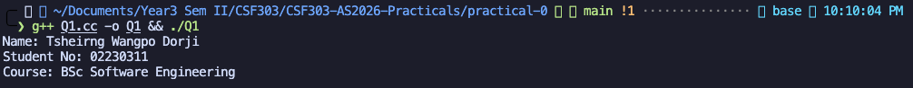
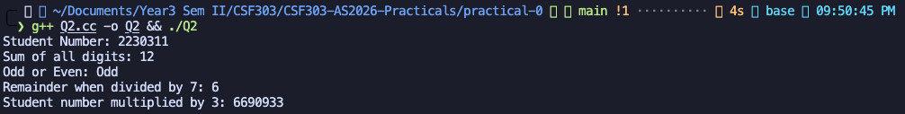
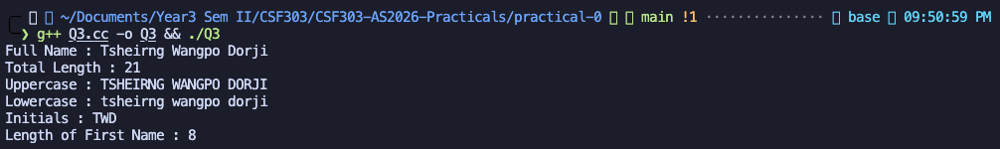
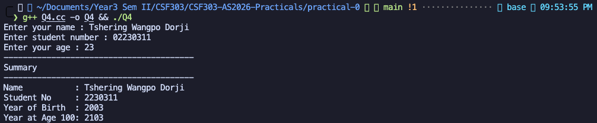
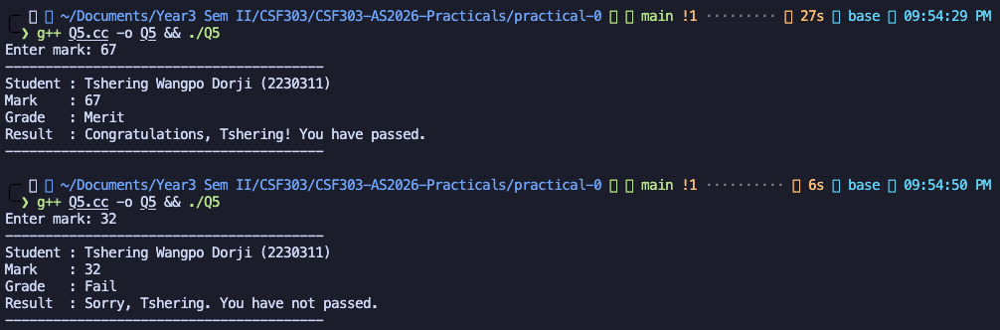
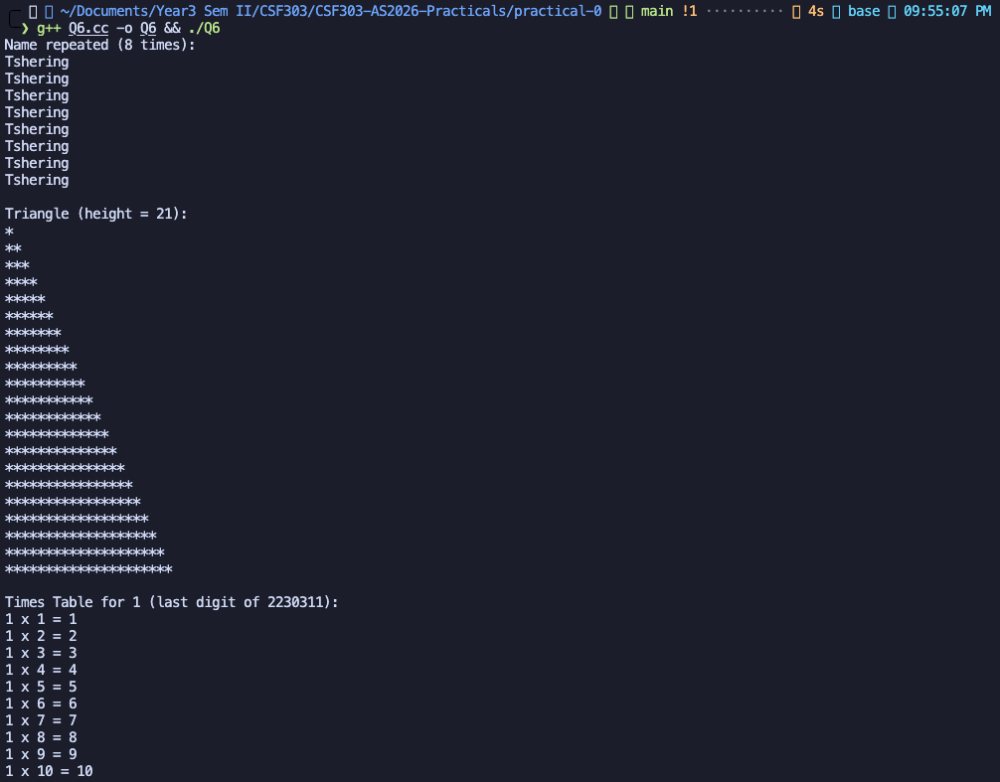
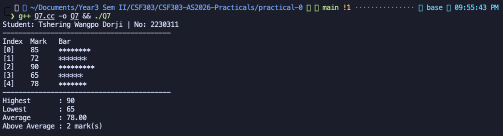
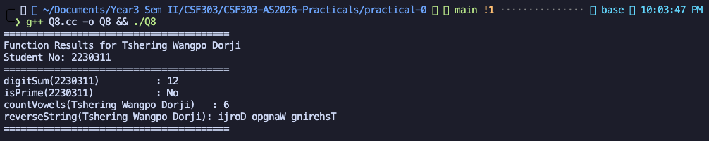
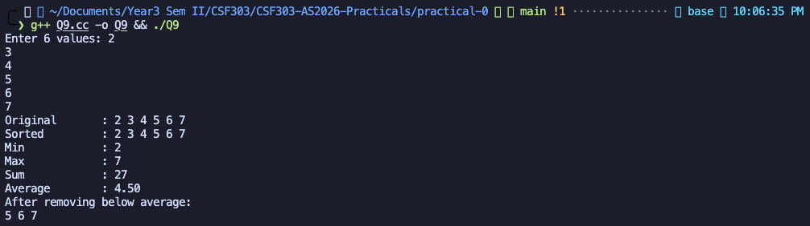
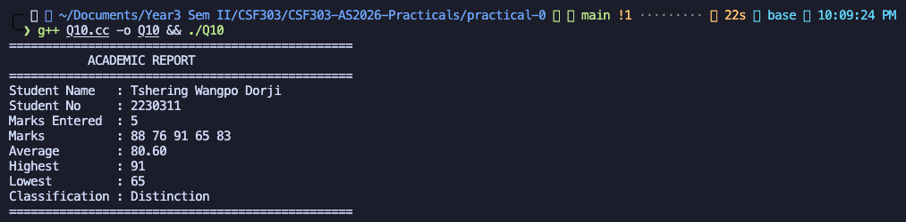

# CSF303-practical-0

C++ Programming Practicals for CSF303 Course - Academic Year 2026

---

## Practical 0 - Fundamental C++ Concepts

This practical covers essential C++ programming concepts including:

- Variables and data types
- Input/output operations
- String manipulation
- Control structures (if-else, loops)
- Arrays and Vectors
- Functions
- Object-Oriented Programming (Classes)

---

### Q1: Student Informations Display

**Description:** This section displays stuent name, enrollment number, and course using string variables and cout statements.

**Concepts:** This helps in understanding Variables, strings, basic output

**Screenshot:**


---

### Q2: Student Number Calculations

**Description:** Performs various mathematical operations on student number, summing up the digits, odd/even check, modulus operation, and multiplication.

**Concepts:** Arithmetic operations, while loops, modulus operator.

**Screenshot:**


---

### Q3: String Manipulation

**Description:** Demonstrates string operations including length calculation, case conversion (upper/lower), extracting initials, and finding the length of the first name.

**Concepts:** String functions, character manipulation, loops, conditional statements.

**Screenshot:**


---

### Q4: User Input and Age Calculator

**Description:** Takes user input for name, student number, and age, then calculates year of birth and the year when the person will turn 100.

**Concepts:** User input (cin), arithmetic operations, formatted output

**Screenshot:**


---

### Q5: Grading System

**Description:** Implements a grading system that takes a mark as input and returns the grade classification (Distinction, Merit, Pass, or Fail) with a messages.

**Concepts:** If-else statements, input validation, string concatenation, conditional statements

**Screenshot:**


---

### Q6: Loops and Patterns

**Description:** Uses loops to: (1) print name multiple times based on its length, (2) create a star triangle pattern, (3) display times table for the last digit of student number.

**Concepts:** For loops, nested loops, pattern generation, modulus operator

**Screenshot:**


---

### Q7: Array Operations and Statistics

**Description:** Works with an array of marks to display them with bar chart visualization, calculate statistics (highest, lowest, average), and count marks above average.

**Concepts:** Arrays, loops, statistical calculations, visualization

**Screenshot:**


---

### Q8: Functions

**Description:** Demonstrates user-defined functions including: digitSum (sum of digits), isPrime (check if number is prime), countVowels (count vowels in string), and reverseString (reverse a string).

**Concepts:** Function declaration, function calls, return values, modular programming

**Screenshot:**


---

### Q9: Vector Operations

**Description:** Uses C++ vectors to store user input, sort values, find min/max, calculate average, and remove elements below average.

**Concepts:** Vectors, STL algorithms (sort, min_element, max_element), accumulate, remove_if

**Screenshot:**


---

### Q10: Object-Oriented Programming - Student Class

**Description:** Implements a Student class with private data members and public methods to manage marks, calculate statistics (average, highest, lowest), determine classification, and print a formatted report.

**Concepts:** Classes, encapsulation, private/public members, constructors, methods, OOP principles

**Screenshot:**


---

## How to Compile and Run

### For any single program:

```bash
cd practical-0
g++ Q1.cc -o Q1
./Q1
```

### For all programs:

```bash
cd practical-0

# Compile all programs
g++ Q1.cc -o Q1
g++ Q2.cc -o Q2
g++ Q3.cc -o Q3
g++ Q4.cc -o Q4
g++ Q5.cc -o Q5
g++ Q6.cc -o Q6
g++ Q7.cc -o Q7
g++ Q8.cc -o Q8
g++ Q9.cc -o Q9
g++ Q10.cc -o Q10

# Run any program
./Q1
./Q2
# ... and so on
```

---
***This Description is made for CSF303***

